# ClimateStation

**Author: Noa Cluer, nc222iw**


### Table of Contents
- [ClimateStation](#climatestation)
  - [Overview](#overview)
  - [Time approximation](#time-approximation)
- [Objective](#objective)
- [Material](#material)
  - [Material List](#material-list)
  - [Components](#components)
- [Software setup](#software-setup)
- [Hardware setup](#hardware-setup)
- [Platform](#platform)
- [Code](#code)
- [Data transmission](#data-transmission)
- [Data presentation](#data-presentation)
- [Final result](#final-result)
- [Credit & Sources](#credits--sources)

### Overview
  This IoT project was made as part of the course **Applied Internet of Things 1DT305**, to explore the range of options for monitoring indoor climate. In this project I have connected a number of sensors to a measuring station, which is uploading data to an online viewing page, in order to get an overview of said climate.

### Time approximation
  To construct your own ClimateStation might take as little as **2 hours** if no problems occur. But, such a scenario is highly unlikely, so the **greater part of an afternoon** is a more realistic estimation. The process can be quickened when connecting multiple ClimateStations, since parts of the setup can be reused between the stations.


## Objective
The basis of the idea behind the project originated in me wanting to explore the limits of using very simple sensors to acquire relevant data. This, in combination with me having recently moved into a restored house, curious about the indoor climate here, resulted in the idea of this climate measurement device.

The **ClimateStation** measures the current relative light level of the area, the relative air humidity, and the ambient temperature using three different sensors (for the benefit of comparison). All the data is then uploaded to the cloud where it can be viewed in datacake, plotted in a graph with previous measurements. This way, the data can be easily analysed and taken upon consideration when making further restorations of the house, or simply be noted for peace of mind and everyday discussions.


## Material

### Material list
Table of contents for original prototype development:

|Amount|Name                          |buy-link   |price  |
|---|------------------------------|-----------|-------|
|1x |Raspberry Pi Pico WH          |[Electrokit](https://www.electrokit.com/raspberry-pi-pico-wh)|99,00 SEK|
|1x |DHT11                         |[Electrokit](https://www.electrokit.com/temp/fuktsensor-dht11)|39,00 SEK|
|1x |MCP9700 TO-92<sup>5</sup>     |[Electrokit](https://www.electrokit.com/mcp9700-to-92-temperaturgivare)|10,50 SEK|
|1x |Photoresistor CdS 4-7kΩ       |[Electrokit](https://www.electrokit.com/fotomotstand-cds-4-7-kohm)|9,50 SEK|
|1x |Yellow LED 5mm diffuse 1500mcd|[Electrokit](https://www.electrokit.com/led-5mm-gul-diffus-1500mcd)|5,00 SEK (min 2)|
|1x |Resistor 0.25W 10kΩ           |[Electrokit](https://www.electrokit.com/motstand-kolfilm-0.25w-10kohm-10k)|1,00 SEK (min 10)|
|1x |Resistor 0.25W 330Ω           |[Electrokit](https://www.electrokit.com/motstand-kolfilm-0.25w-330ohm-330r)|1,00 SEK (min 10)|
|1x |Breadboard                    |[Electrokit](https://www.electrokit.com/kopplingsdack-840-anslutningar)|69,00 SEK|
|1x |Wires (bundle)                |[Electrokit](https://www.electrokit.com/labbsladd-40-pin-30cm-hane/hane)|55,00 SEK|
|**Total:**|*(excluding some duplicates)*||**289,00 SEK**|

### Components
**The Raspberry Pi Pico WH** is a MCU unit with integrated WiFi support, and pre-soldered header pins. It is highly flexible, cost-efficient, and widely used in IoT devices across the world. It is also the MCU unit that I've used the most previously, and the one included in the package of recommended hardware for this course<sup>1</sup>. In this project, I also utilize it's on-board LED, and temperature sensors. The RPI Pico W has two cores, runs using the RP2040 chip, and has 2MB flash memory<sup>2</sup>.

**DHT11** is a digital temperature and humidity sensor, appreciated for it's operability and user-friendliness. It too was part of the recommended course hardware package, and I had previous experience using it. Boasting a precision of ±1°C the DHT11 is also quite precise for its cost.

**MCP9700 TO-92** is an analog alternative to the more complicated temperature sensors. Thanks to its structural simplicity it is much cheaper, but also comes with the reduced precision of "only" ±2°C in comparison with the DHT11. It also doesn't have an integrated humidity sensor, and the analog value has to be manually converted into a digital temperature reading.

**A photoresistor** such as the CdS 4-7kΩ, is a resistor that varies its resistance based on the surrounding light. The current is conducted over a light-sensitive membrane, increasing the resistance with surrounding brightness. 

**LEDs** light up, easily controlled via GPIO pins.

**Resistors** add resistance to the circuit, mostly to protect sensitive components.

**A breadboard** is used to attach components during prototype development, since it allows you to move them around while maintaining function.

**Wires**: everyone knows what a wire does.


## Software setup
I chose to use **Thonny** as my IDE for the software part of this project, looking for simplicity. To download and set up the IDE, follow these steps.

* Get the latest Thonny [download exe](https://github.com/thonny/thonny/releases/download/v4.1.7/thonny-4.1.7.exe) for your computer's operating system.

* Open the .exe file, that most likely gets placed in your downloads folder.

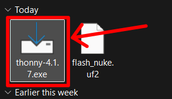

* Get through the install wizard, and launch the program.

* Whilst holding down the bootsel button<sup>3</sup> on the RPI Pico, connect it to your computer.

* Then, install micropython on the RPI Pico, using the lower right menu. *(The text will look slightly different)*

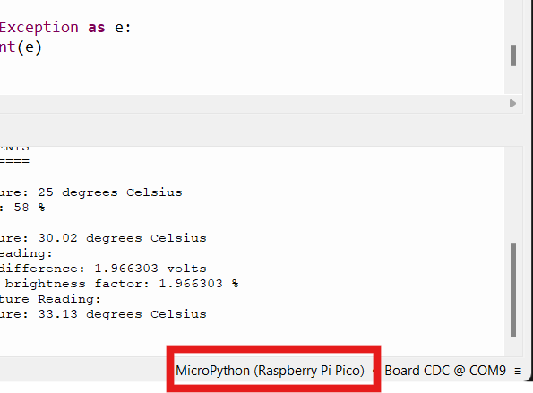
* Choose the correct version of micropython<sup>4</sup>. *(The current latest version is v1.25.0)*


* Click the stop button, and then (when the device is recognized) run the relevant file.

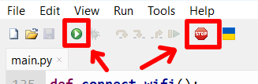

* When you have a working file, save **main.py** to the RPI Pico. It has to be named `main.py` for micropython to recognize it upon startup, and then simply plug the ClimateSensor into any usb power outlet. *(The WiFi-login credentials are stored in another file **keys.py** that you also have to upload to the RPI Pico before unplugging, see [the code](#code))*.

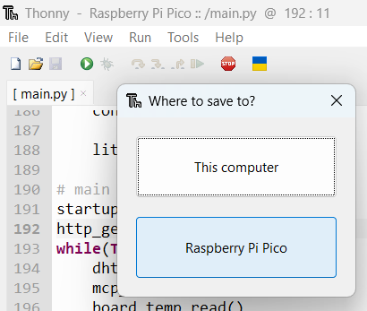

* *Note: you might have to unplug, and reconnect the device if the on-board LED hasn't lit up a few seconds after the yellow LED start-sequence is done. If the on-board LED is not lit, it means that the device hasn't successfully connected to WiFi yet. I had some issues with that, but reconnecting the power cable solved the issue.*

## Hardware setup
A diagram of the circuit *(with some components only labeled)*<sup>7</sup>:

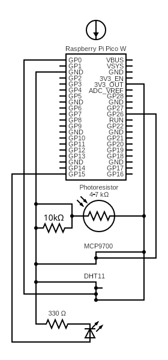

Image of the breadboard setup *(notice the on-board LED being lit while the program is running)*:

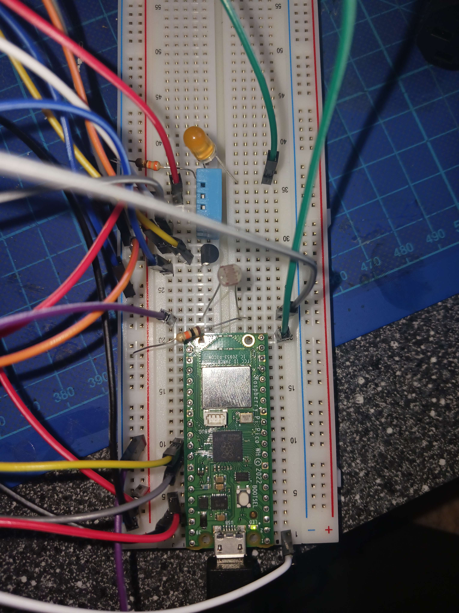

The slight mess of wiring could of course be improved greatly by simply soldering the project onto a perf board, maybe along the lines of the below image, a good first step if bringing the ClimateStation into a more industiral setting. By soldering onto a perf board, or even directly to the RPI Pico, a lot of space is saved making it possible to fit into a case of some kind.

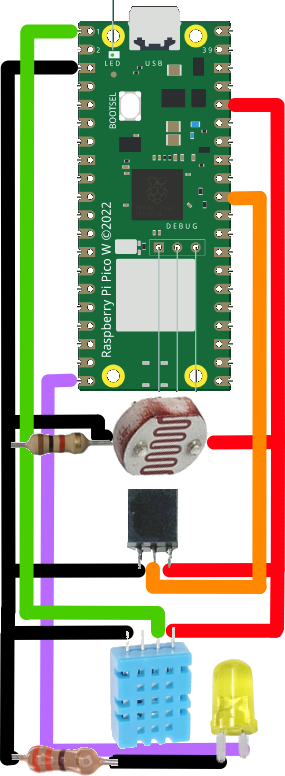

### Calculations
Most parts of this project were quite straight forward, but especially the daylight sensor needed some calculations. Based on it's range (4-7kΩ), I opted for a 10kΩ resistor as comparison. This after recommendation<sup>6</sup>, lead to the photoresistor outputting a voltage range of around 0-3.2, based on the local surrounding brightness. This sensitivity range can be offset by changing the reference resistor.

Since the *ClimateStation* is supposed to be perpetually plugged into a power outlet, few considerations on exact power consumption have been made, but it should be rather low. The program spends around 0.5 seconds measuring and transmitting data, and then 15 minutes in timer sleep. This means that the "efficient" uptime is only around **0.056%**, and the remaining time spent waiting.


## Platform
Firstly, I chose to explore using WiFi to directly transfer the data over the internet. This choice was quite handy, seeing as my intended placement of the *ClimateStation* was in my office-like room, right by my router. This avoided the main downside of using WiFi, the limited range. And as previously mentioned, the project is at all times connected to a power outlet, meaning the higher energy consumption that comes from communication via WiFi will not really affect it.

Then, as a data viewing platform, I chose datacake. Mostly for its simple interface, and due to previous experience with the program. There was also quite a bit of code examples of how to interface with datacake using http, instead of the more commonly used partner within IoT spaces, LoRaWAN. Datacake has a generous free-tier<sup>8</sup> of up to 5 connected devices, and a data retention of 7 days. This is all that is needed to create a proof of concept for this project, and to have basic every-day use of the device. You can then create dashboards of your device data, that in a simple and clear way convert the data to e.g. graphs. But the greatest benefit might very well be to not have to have a server device running constantly from home, seeing as datacake is a cloud service. 

*Device menu in datacake*

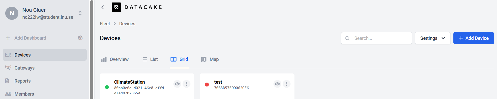

*A dashboard in datacake<sup>9</sup>*

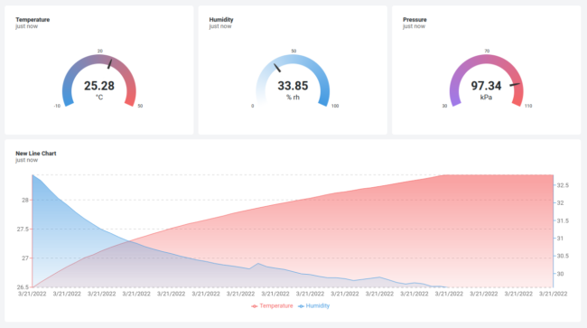

If this project was to be scaled, or simply more time invested into it, other platform compositions could be considered. The one I was most tempted by was using WiFi with a self-hosted ELK-stack<sup>10</sup>. This setup would have been way more scaleable, and given even more control to the backend owner (you). It would also have meant exploring a more complex and interesting option than datacake. By hosting the data storage server yourself, you would for example not necessarily have been limited to the 7 days of data retention, or set upload rate (500 uploads/day with free tier of datacake).


## Code
**Firstly**, for the code to work, you have to fill in your WiFi networks SSID and PASSWORD in [```keys.py```](./src/keys.py). The program was constructed this way as to in a simple manner retain the network privacy a little better.

All of the required code is in the /src package, even the [micropython.uf2](https://micropython.org/resources/firmware/RPI_PICO-20250415-v1.25.0.uf2)-file<sup>11</sup> needed to run .py files *(most likely already installed via the Thonny IDE as per [above](#software-setup))*. So you could simply download the files [`keys.py`](./src/keys.py), [`main.py`](./src/main.py), and [`RPI_PICO-v1.25.0.uf2`](./src/RPI_PICO-v1.25.0.uf2), change the network credentials in `keys.py`, and then save them all on your RPI Pico. 

*In essence, the program consists of the following:*

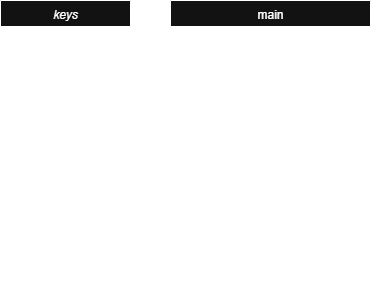

*Feel free to check out the code files, they are not that cumbersome.*


## Data transmission
Based primarily off of limitations set up by datacake, the current upload frequency is set to 15 minutes. This can easily be changed by modifying the sleep value in the main loop of `main.py`.

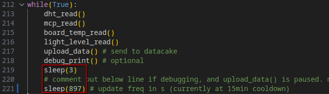

Note; if using the free tier of datacake, you have maximum of 500 datapoints per day *(equivalent to a maximum upload frequency of every 2.88 minutes)*, and if displaying with the timeframe "per day", the graph precision is every 15 minutes. The DHT11 also has a maximum reading frequency of every two seconds *(which is very negligable in comparison)*. Based on all this, I found that an upload frequency of every 15 minutes would be fitting.

The actual transmission is handled as follows:
* A `WiFi` connection is established.
* **Every 900 seconds:**
  * `MicroPython` code on the device reads the sensors.
  * The data is compacted into a `.json` package.
  * The package is sent as a `HTTP` POST request.
  * The request is transferred via `TCP` connection to datacake.
  * Datacake deconstructs the package, and stores the values as `fields`.
  * Datacake updates the `dashboard` with the most recent data from relevant fields. 
  * The device sleeps the remaining time.

In terms of electricity used, and device range, the big issue is my decision to use WiFi instead of something like LoRaWAN. Using WiFi is quite costly power-wise, and it limits the device range to below 100m from a router. Ideally it should be kept only indoors, and not have to rely on battery usage at all. Luckily, that is exactly what my plan and design does! It is intended to be mounted indoors, monitoring **indoor** climate, and to be connected to a power outlet. This, in combination with the comparatively long sleep the device enters between transmissions should make the device rather energy efficient for its intended use. Security-wise, the system isn't that protected, but it also isn't really considered a valuable target for any kind of attacks. Its a small, not too expensive device, presumably placed indoors, and at least for the data uploads it is using *https*, thereby guaranteeing some protection.

## Data presentation
Here in the dashboard for the project, we can see the metrics that are tracked.

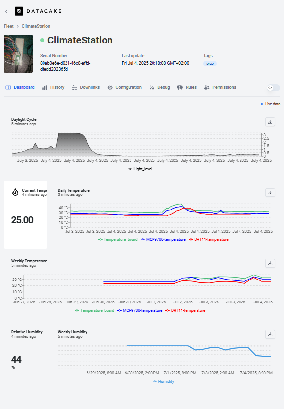

Some things worthy of noting are the temperature graphs displaying all three different temperature metrics for comaparison, and the difference in precision between the daily and weekly graphs. While the daily graphs have a plot for every 15 minutes, the weekly ones only have an average value for every 2h. This made the daylight graph so imprecise that I opted for only viewing the daily version. The big jump at the beginning of the Dayligt Cycle graph can be explained by my bad sleep schedule. I stay up late, with the lights on, and when I go to sleep, the sensor quickly realizes how dark it is outside. In the morning the darkness goes away at a way more even rate, creating a beatuiful curve. It is while designing this dashboard *(choosing widgets)* that you become slightly limited by the 7 days of data retention from the free tier. Especially temperature data would have been fun to analyse on a larger timeframe.

## Final Result
The final version of the project, the **ClimateStation, mk .5**:

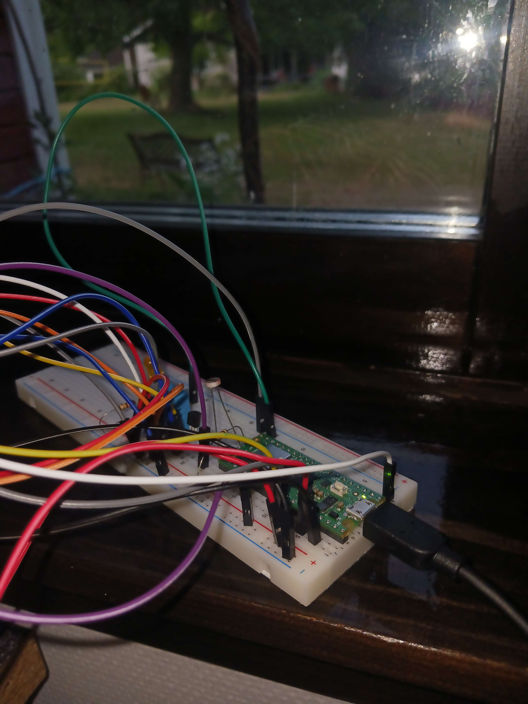

The measurements can be viewed over at the [dashboard](https://app.datacake.de/pd/d020b65c-bb35-4199-a751-88c524848a5a) on datacake, and will stay live-updated for a while after the completion of this project.

While I am happy with the results, I see a lot of potential areas of improvements. But, as far as developing a prototype goes, I see this project as done. I haven't found any notable issues with the **mk .5**, and would likely go on to design a *mk 1.0* directly off of the current level of progress.

For this potantial mk 1.0-version, I would like to do a number of things:
* Switch over to using ELK-stack. This in order to increase the scaleability of the project, and get rid of the 7 day data retention limit, while still not having to pay any upkeep costs, since ELK-stack is open-source.
* Fix the wiring. In its current state, the wires are to say the least, a mess. The best would probably be to solder the components into place, based off of the suggestion in [hardware setup](#hardware-setup).
* Get a case. To protect the sensor against outside damage of all sorts, and to better it's looks as a product, I would have liked 3d-printing a case for it. This is quite a bummer that I didn't get the time to do, since I really like CAD, but designing a case would have had to be done **after** soldering the components to a perf board. And that became an issue since I didn't feel like soldering my only components that permanently together, and didn't have access to a perf board at home.
* Fix the code a bit. I'm not super happy with the current methods, and I really feel like the network login could be handled better, maybe with a small configuration program run upon the devices' first startup?

Either way, this is where I leave this project for this time. Good luck with your own projects, and thanks for reading this far!


## Credits & Sources
<sup>1</sup>https://www.electrokit.com/lnu-starter

<sup>2</sup>https://www.raspberrypi.com/documentation/microcontrollers/pico-series.html

<sup>3</sup>https://datasheets.raspberrypi.com/picow/PicoW-A4-Pinout.pdf

<sup>4</sup>https://static1.xdaimages.com/wordpress/wp-content/uploads/2024/12/thonny-install-micropython-dialog.jpg?q=70&fit=crop&w=825&dpr=1

<sup>5</sup>https://ww1.microchip.com/downloads/aemDocuments/documents/MSLD/ProductDocuments/DataSheets/MCP970X-Family-Data-Sheet-DS20001942.pdf

<sup>6</sup>Thanks to [Antrakasus](https://github.com/Antrakasus) for help with the photoresistor sensitivity offset issue.

<sup>7</sup>https://www.circuit-diagram.org/editor/

<sup>8</sup>https://datacake.co/pricing

<sup>9</sup>https://blog.golioth.io/wp-content/uploads/2022/03/datacake-integration-dashboard.png

<sup>10</sup>https://hackmd.io/q1u1hr45S-uvJCXz05aRLw

<sup>11</sup>https://micropython.org/download/RPI_PICO/

*Further credits have been linked in the code comments.*